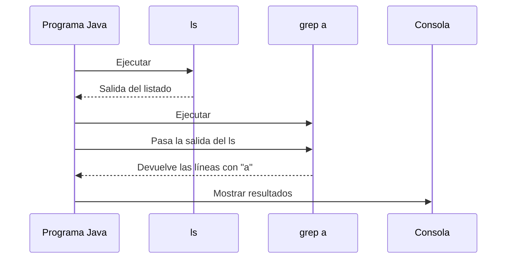

# Programa LsGrep

Este programa en Java ejecuta un comando "ls" y luego filtra su salida para mostrar solo las líneas que contienen la letra "a" utilizando el comando "grep a".
> https://github.com/liuDam1/ejercicioLsGrep.git

## Diagrama de Secuencia



## Funcionalidad

El programa:
1. Lanza un proceso hijo que ejecuta el comando "ls"
2. Lee la salida del comando "ls"
3. Lanza otro proceso hijo que ejecuta el comando "grep a"
4. Envía la salida del comando "ls" como entrada al comando "grep a"
5. Lee y muestra por consola la salida del comando "grep a"

## Descripción detallada

### 1. Ejecutar el comando "ls"

```java
// Ejecutar el comando ls y leer su salida
String salidaLs = ejecutarComando(COMANDO_LS);
```

En esta línea, el proceso padre (Programa Java) llama al método `ejecutarComando()` para crear un proceso hijo que ejecutará el comando "ls". El comando "ls" está definido como un array de strings estático `COMANDO_LS`.

### 2. Crear el proceso hijo para "grep"

```java
// Ejecutar el comando grep con la salida de ls como entrada
String salidaGrep = ejecutarComando(COMANDO_GREP, salidaLs);
```

Aquí se crea un segundo proceso hijo ("grep a") y se le envía la salida del primer proceso hijo ("ls") como entrada. Esto es un ejemplo de cómo el proceso padre actúa como intermediario entre dos procesos hijos.

### 3. Interacción entre Proceso Padre y Procesos Hijos

Dentro del método `ejecutarComando()`:

```java
private static String ejecutarComando(String[] comando, String entrada) throws IOException {
    // El proceso padre crea un proceso hijo
    Process proceso = Runtime.getRuntime().exec(comando);

    // Interacción de salida del padre hacia el hijo (si se proporciona entrada)
    if (entrada != null) {
        try (OutputStream output = proceso.getOutputStream();
                PrintWriter pw = new PrintWriter(new OutputStreamWriter(output))) {
            // El padre envía datos al hijo a través del flujo de salida del proceso
            pw.print(entrada);
            pw.flush();
        }
    }

    // Interacción de entrada del hijo hacia el padre (lectura de la salida del hijo)
    return leerSalida(proceso);
}

private static String leerSalida(Process proceso) throws IOException {
    StringBuilder resultado = new StringBuilder();
    try (BufferedReader lector = new BufferedReader(new InputStreamReader(proceso.getInputStream()))) {
        // El padre lee datos del hijo a través del flujo de entrada del proceso
        String linea;
        while ((linea = lector.readLine()) != null) {
            resultado.append(linea).append(SALTO_LINEA);
        }
    }
    return resultado.toString();
}
```

Este bloque de código obtiene el flujo de salida del proceso Java, que está conectado a la entrada estándar del proceso hijo (grep). Utilizando un `PrintWriter`, envía la salida del comando "ls" al comando "grep".

### 4. Leer la salida del proceso hijo

En el método `leerSalida()`:

```java
private static String leerSalida(Process proceso) throws IOException {
    StringBuilder resultado = new StringBuilder();
    try (BufferedReader lector = new BufferedReader(
            new InputStreamReader(proceso.getInputStream()))) {
        String linea;
        while ((linea = lector.readLine()) != null) {
            resultado.append(linea).append("\n");
        }
    }
    return resultado.toString();
}
```

Este método lee la salida estándar del proceso hijo (grep) línea por línea, construyendo una cadena con todas las líneas que contienen la letra "a".

### 5. Mostrar la salida por consola

```java
// Mostrar la salida filtrada por grep
System.out.println(salidaGrep);
```

Finalmente, la salida filtrada por grep se muestra en la consola.

## Manejo de errores

El programa incluye un manejo básico de errores que muestra un mensaje genérico si ocurre una excepción durante la ejecución de los comandos:

```java
try {
    // Código de ejecución
} catch (IOException e) {
    System.out.println(MSG_ERROR);
    System.exit(34);
}
```

### 5. Flujo Completo de Ejecución

1. El proceso padre (Programa Java) inicia la ejecución.
2. Crea el proceso hijo "ls" y espera a que termine.
3. Lee la salida del proceso "ls".
4. Crea el proceso hijo "grep a" y le envía la salida de "ls" como entrada.
5. Lee la salida del proceso "grep a" que contiene solo las líneas con la letra "a".
6. Muestra la salida final al usuario y finaliza la ejecución.

## Explicación de los métodos ejecutarComando

El programa implementa dos versiones sobrecargadas del método `ejecutarComando`:

### 1. Versión principal: ejecutarComando(String[] comando, String entrada)

```java
private static String ejecutarComando(String[] comando, String entrada) throws IOException {
    // El proceso padre crea un proceso hijo
    Process proceso = Runtime.getRuntime().exec(comando);

    // Interacción de salida del padre hacia el hijo (si se proporciona entrada)
    if (entrada != null) {
        try (OutputStream output = proceso.getOutputStream();
                PrintWriter pw = new PrintWriter(new OutputStreamWriter(output))) {
            // El padre envía datos al hijo a través del flujo de salida del proceso
            pw.print(entrada);
            pw.flush();
        }
    }

    // Interacción de entrada del hijo hacia el padre (lectura de la salida del hijo)
    return leerSalida(proceso);
}
```

Este es el método principal que:
- Crea un proceso hijo para ejecutar el comando especificado
- Permite enviar datos al proceso hijo si se proporciona una entrada
- Lee y devuelve la salida del proceso hijo

### 2. Versión sobrecargada: ejecutarComando(String[] comando)

```java
private static String ejecutarComando(String[] comando) throws IOException {
    // Llama a la versión principal sin proporcionar entrada (null)
    return ejecutarComando(comando, null);
}
```

Esta versión simplificada:
- Sirve como un método auxiliar que llama a la versión principal
- No envía ninguna entrada al proceso hijo (pasa null)
- Es útil para ejecutar comandos que no necesitan una entrada previa, como "ls"

## Constantes Utilizadas

El programa define las siguientes constantes estáticas finales:

```java
private static final String MSG_ERROR = "Error al ejecutar el comando";
private static final String[] COMANDO_LS = {"ls"};
private static final String[] COMANDO_GREP = {"grep", "a"};
private static final String SALTO_LINEA = "\n";
```

- `MSG_ERROR`: Mensaje mostrado al usuario en caso de error
- `COMANDO_LS`: Array que define el comando "ls" a ejecutar
- `COMANDO_GREP`: Array que define el comando "grep a" a ejecutar
- `SALTO_LINEA`: Constante para representar un salto de línea

## Flujo Completo del Método Main

Aquí está la estructura completa del método `main` que muestra todo el flujo de ejecución:

```java
public static void main(String[] args) {
    try {
        // Ejecutar el comando ls y leer su salida
        String salidaLs = ejecutarComando(COMANDO_LS);
        
        // Ejecutar el comando grep con la salida de ls como entrada
        String salidaGrep = ejecutarComando(COMANDO_GREP, salidaLs);
        
        // Mostrar la salida filtrada por grep
        System.out.println(salidaGrep);
    } catch (IOException e) {
        System.out.println(MSG_ERROR);
        System.exit(34);
    }
}
```

## Notas Técnicas

- Este programa utiliza clases de Java como `Process`, `Runtime`, `BufferedReader`, y `PrintWriter` para interactuar con procesos del sistema operativo.
- Se utiliza try-with-resources para asegurar que todos los flujos de entrada/salida se cierren correctamente, evitando fugas de recursos.
- El programa está diseñado para funcionar en entornos Unix/Linux o Windows con herramientas como Git Bash que proporcionan comandos como "ls" y "grep".
- En Windows sin Git Bash, los comandos "ls" y "grep" no estarán disponibles, y el programa no funcionará correctamente.
- El código sigue el principio DRY (Don't Repeat Yourself) al reutilizar el método `ejecutarComando` para diferentes fines.
- El código utiliza sobrecarga de métodos para proporcionar una interfaz más flexible al usuario del código.

